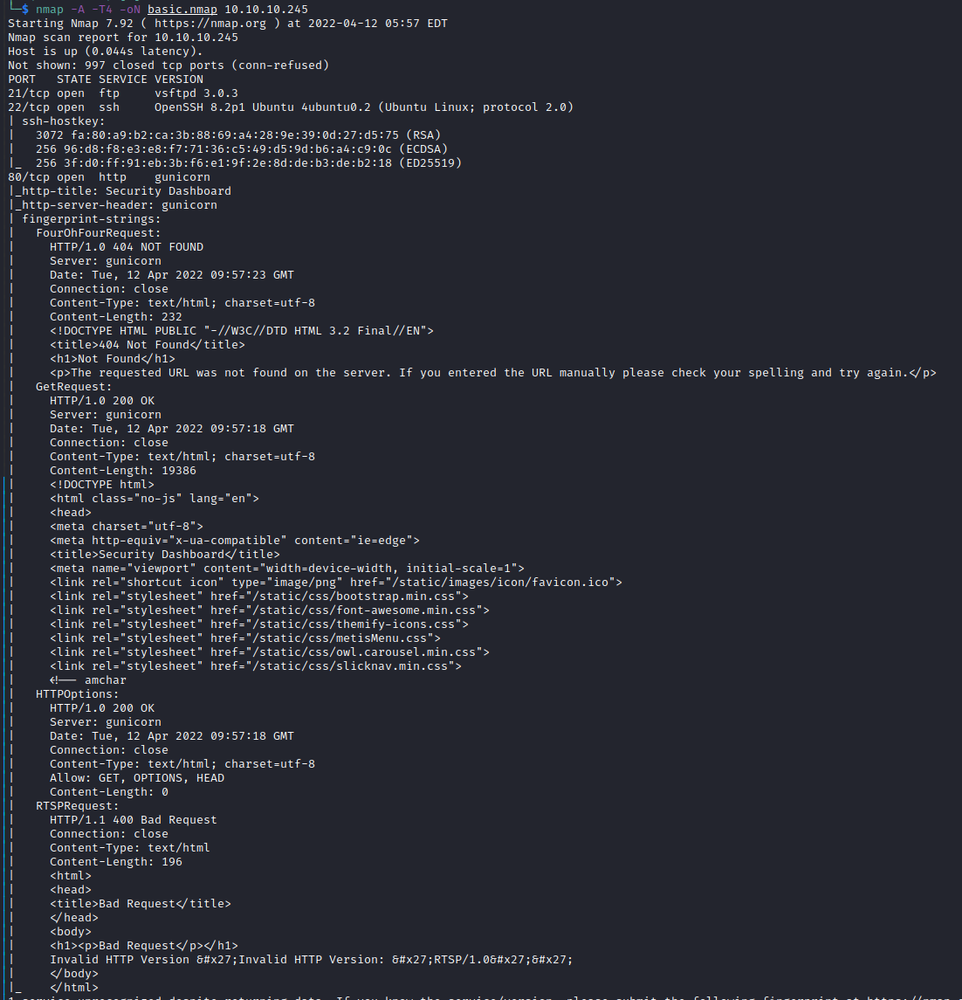
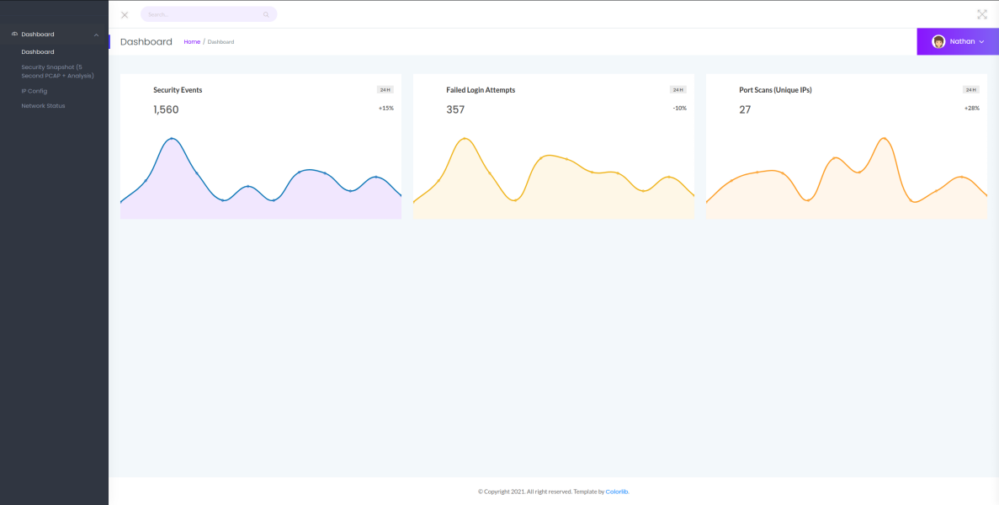
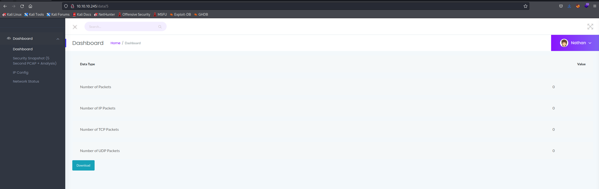
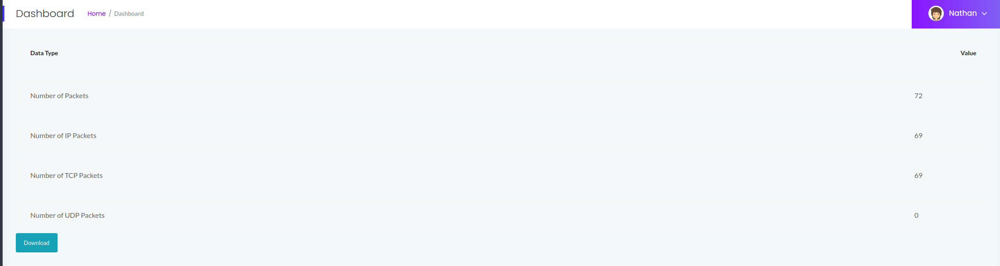
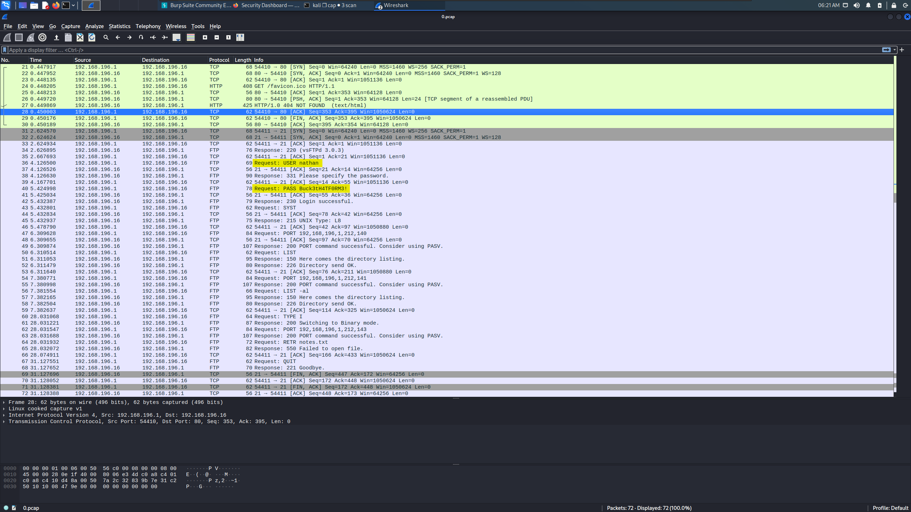
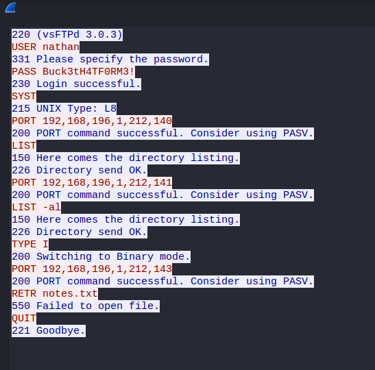
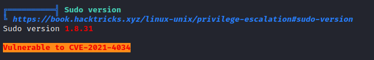
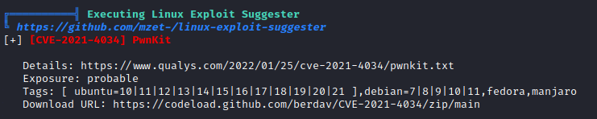
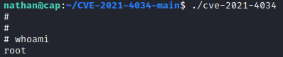

# Cap
## Scanning & Enumeration
### Nmap

There's FTP (21) and HTTP (80). HTTP is running something called `gunicorn`.

### Web

We're in a dashboard. The side menu shows:
- PCAP snapshot
- IP Config
- Network Status

Open Wireshark and press the PCAP option and we see this:

0 packets because that's us, but the url is `10.10.10.245/data/5`, and that `5`could be an ID. Let's try other IDs.

`10.10.10.245/data/0` returns some packets which we can download and check with Wireshark.

There's an FTP stream, let's follow it:

We have some credentials for FTP!

- Username: **nathan**
- Password: **Buck3tH4TF0RM3!**

If we access it through FTP we log into `/home/nathan` where we can find the `user.txt` flag.

We can try to log into it using SSH with the same credentials and see if it's using the same password, it works!

Now we can set up an HTTP server on our host machine and use it to get `linpeas.sh` onto the victim and run it. We get this:

It's vulnerable to `CVE-2021-4034`! We can find information about this a few lines underneath.

We download it into the host, use the HTTP server to get it to the victim, unzip it and `make` and run the exploit and we're root!

Now we can go to `/root` and get the last flag.